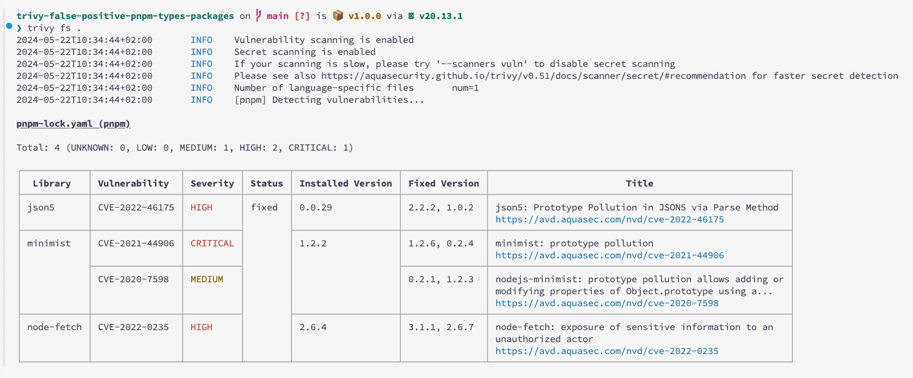

# Trivy False Positive on PNPM `@types`-packages
Highlights false positive for trivy scan for `@types/packages` when using pnpm.

## Info
The following `@types` packages are installed via `pnpm`:

- `@types/json5@0.0.29`
- `@types/minimist@1.2.2`
- `@types/node-fetch@2.6.4`

Running `trivy fs` scan yields the following false positive errors:

## Note

This only happens for the `pnpm` package manager.

## Update

This was discussed in this issue here [aquasecurity/trivy/discussions/6749](https://github.com/aquasecurity/trivy/discussions/6749), however closed as a non-issue, since trivy currently does not support pnpm9 where this problem incurs.
